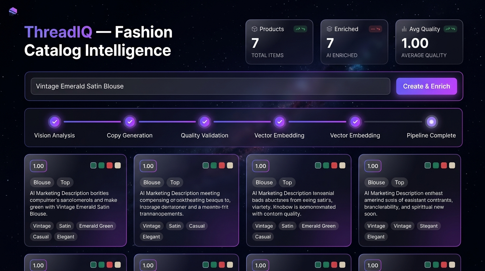

# ThreadIQ — AI Fashion Catalog Intelligence Platform

ThreadIQ is an AI-powered fashion catalog intelligence platform that transforms raw e-commerce listings into rich, standardized, high-converting product catalog data. E-commerce platforms often suffer from inconsistent metadata, missing attributes, and poor search capabilities. ThreadIQ solves this by processing products through an automated 4-stage AI agent pipeline that extracts visual features, generates marketing copy, audits metadata quality, and computes dense vector embeddings for real-time semantic search.



---

## Features

- **FastAPI REST API**: High-performance asynchronous API endpoints for product lifecycle management.
- **PostgreSQL & SQLAlchemy 2.0**: Relational database architecture with ORM data mapping, clean service-repository layer, and Docker Compose orchestration.
- **4-Stage AI Agent Pipeline**:
  1. **Vision Agent**: Analyzes garment titles and imagery to extract visual features (category, primary/secondary colors, sleeve style, fit).
  2. **Description Agent**: Synthesizes structured attributes into compelling marketing titles, product descriptions, and catalog search tags.
  3. **Validation Agent**: Audits metadata completeness, attribute consistency, and generates quality scores (0.0 to 1.0).
  4. **Embedding Agent**: Generates 128-dimensional vector embeddings for exact semantic catalog indexing.
- **128-d Vector Semantic Search**: Real-time vector similarity matching over PostgreSQL database records.
- **Interactive Web Dashboard**: Glassmorphic SPA dashboard served at `/demo` with live pipeline visualization, product creation, search filtering, and catalog management.
- **Automated Test Suite**: Full integration and unit test coverage powered by `pytest`.

---

## Quickstart

Get ThreadIQ up and running locally in 5 commands:

```bash
git clone https://github.com/Malavikavinod7/thread-iq.git && cd thread-iq
cp .env.example .env
docker compose up -d
pip install -r requirements.txt
python app/db/seed.py && uvicorn app.main:app --reload
```

- **Live Interactive Dashboard**: `http://localhost:8000/demo`
- **Interactive OpenAPI Docs**: `http://localhost:8000/docs`

---

## API Endpoints

| Method | Endpoint | Description |
| :--- | :--- | :--- |
| `GET` | `/health` | Service health status check |
| `GET` | `/demo` | Interactive web dashboard |
| `POST` | `/api/v1/products` | Create a product & run the AI enrichment pipeline |
| `GET` | `/api/v1/products` | List paginated products with category filtering |
| `GET` | `/api/v1/products/{id}` | Get product details & AI enrichment metadata |
| `DELETE` | `/api/v1/products/{id}` | Delete a product and associated jobs |
| `POST` | `/api/v1/products/search` | Perform 128-d vector semantic search |
| `GET` | `/api/v1/jobs/{id}` | Retrieve background job execution status |

---

## Project Structure

```
threadiq/
├── app/
│   ├── agents/            # Vision, Description, Validation, Embedding AI agents
│   ├── api/v1/            # FastAPI REST API endpoints
│   ├── core/              # Config, dependencies, enums, exceptions
│   ├── db/                # Database engine session, base, and seed script
│   ├── models/            # SQLAlchemy database models (Product, Job)
│   ├── repositories/      # SQLAlchemy repository implementations
│   ├── schemas/           # Pydantic request/response validation schemas
│   ├── services/          # Business logic, agent orchestrator, product service
│   ├── static/            # Dashboard web interface (index.html)
│   └── main.py            # FastAPI application entrypoint

├── docs/                  # Screenshots & project documentation
├── tests/                 # Automated Pytest test suite
├── .env.example           # Environment variables template
├── docker-compose.yml     # PostgreSQL container configuration
├── requirements.txt       # Python dependencies
└── README.md
```

---

## Roadmap

- **Celery + Redis Distributed Queue**: Scaling asynchronous job execution across distributed worker nodes.
- **Dedicated Vector Database**: Migration to `pgvector` or Qdrant for billion-scale vector indexing.
- **Alembic Database Migrations**: Automated schema migration tracking for enterprise deployment.
